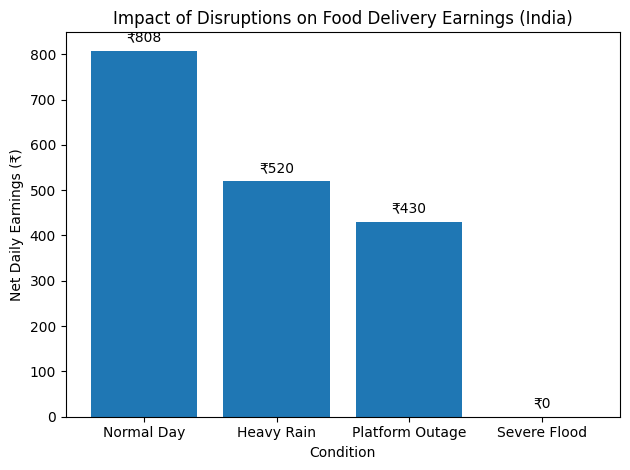

## Introduction

India's food delivery workforce is the operational backbone of a multi-billion dollar platform economy. Delivery partners working for Zomato, Swiggy, and similar platforms number in the millions, yet they operate without any safety net against the external disruptions that routinely erase their income. According to the Fairwork India Report 2024, delivery workers earn ₹15,000–20,000 per month — already below the effective minimum wage for hours worked — and no major platform scored above 6 out of 10 on fair labour standards. When disruptions strike, workers absorb the full financial blow alone.
The income loss problem is structural, not incidental. Platform pay is a piece-rate plus incentive stack: a base per-order payment (typically ₹20–50 within a ~5 km radius), supplemented by slab-based bonuses tied to completing daily delivery targets of 10, 20, or 25 orders. This means disruptions have a non-linear effect — missing a slab threshold because a flood cut two hours from a shift can cause earnings to fall far more sharply than the lost hours alone would imply. Zomato's own public data (2026) shows that a full-time partner working 10 hours/day earns around ₹102/hour gross, with ~20% leaking to fuel and maintenance — leaving a net daily income of roughly ₹808, a margin thin enough that a single disrupted day is a meaningful financial shock.
This platform is an AI-enabled parametric insurance solution built specifically for food delivery partners. When a qualifying external disruption is verified through objective, third-party data sources, a payout is automatically credited to the worker's UPI wallet — no claims forms, no adjusters, no waiting. Coverage is strictly limited to income lost from external disruptions. Health, life, accidents, and vehicle repairs are explicitly excluded. At a practical level, this problem is visible in everyday conversations around gig work — a single disrupted evening shift can wipe out a significant portion of a worker’s weekly income. This is not an edge case, but a recurring pattern.
We are not insuring accidents — we are insuring the hours a worker never gets the chance to work.

## Persona: The Food Delivery Partner

Our chosen sub-category is **food delivery partners** (Zomato / Swiggy). The persona is a delivery partner aged 20–35, working in a Tier 1 or Tier 2 Indian city. Survey data from NCAER (across 28 cities) distinguishes two main working patterns: "long-shift" workers (~11 hours/day, ~69 hours/week) who depend on platform income as their primary livelihood, and "short-shift" workers (~5 hours/day) with lower but still meaningful reliance. Our initial product targets the **high-engagement segment** — workers active on the platform for at least 15 days in a rolling 30-day window — because their income loss from disruptions is greatest and their need for protection most acute.

Income is heavily concentrated in the evening dinner window (around 7–10 PM), when platform incentive bands are highest. Workers cluster their hours around peak windows to hit slab thresholds. This creates a specific vulnerability: a two-hour weather disruption during the dinner peak does not just cost two hours of base pay — it can knock a worker off their entire daily incentive slab, causing an outsized earnings drop. In simple terms, the system rewards consistency — and punishes even short interruptions disproportionately. Workers are not just paid for time spent, but for hitting targets that disruptions can easily derail.

**Income vs. Disruption — Why a Single Bad Day Hurts So Much**

| Condition | Est. Daily Earnings | What Happens |
|---|---|---|
| Normal Day (10 hrs) | ₹808 net | Full slab bonus achieved |
| Moderate Rain (6 hrs lost) | ~₹480 net | Slab threshold missed — bonus lost entirely |
| Flood / Red Alert (full day) | ₹0 | No orders assigned; platform may suspend service |
| Platform Outage (2 hrs peak) | ~₹560 net | Peak-hour orders lost; slab likely missed |

The drop from a normal day to a flood day is not 20% — it is 100%. And the drop from a normal day to a rain-disrupted day is not proportional to lost hours; it is amplified by the slab cliff. This is the gap parametric insurance is built to fill.

**Scenario A — Monsoon Disruption:** Swiggy and Zomato have previously halted food delivery services in parts of Delhi-NCR during severe waterlogging. A delivery partner loses the entire peak dinner window. The platform detects that IMD's red-alert threshold for the zone has been met, cross-references it with OpenWeatherMap, and automatically initiates a payout for the covered hours to the worker's UPI ID.

**Scenario B — Platform Outage:** A Swiggy server outage prevents order assignment for over 90 minutes. The worker is logged in but earns nothing. The Zomato delivery partner contract itself acknowledges that technical failures attributable to the platform should result in compensation — our system makes this instantaneous and standardised rather than case-by-case. The platform health monitor confirms the outage and triggers an automatic payout.

**Scenario C — Civic Restriction:** Gig worker groups have called all-India strikes on high-earning dates including New Year's Eve — one of the highest-demand days of the year. An unplanned bandh or curfew in a city zone prevents access to pickup and drop locations. Government notification feeds and news APIs confirm the restriction, and workers in the affected zone receive a payout for the blocked hours.

### Impact of Disruptions on Daily Earnings

*Values are illustrative estimates derived from reported earnings structures, fuel costs, and observed disruption impacts in Indian food delivery platforms.

---

## Application Workflow

The platform is a **web application**, accessible via any browser on desktop or mobile. The workflow runs across three layers: Onboarding, Policy Management, and Claims Automation.

**Onboarding:** A delivery partner registers via mobile number and platform partner ID (Zomato/Swiggy). The system collects their primary working zone (city + micro-zone), average daily active hours, delivery platform, and UPI ID. Eligibility is verified against a minimum activity threshold (15+ active days in the past 30) to ensure coverage targets workers with genuine income dependence. An ML risk profile is generated at registration using historical weather, traffic, platform uptime, and civic disruption data for the worker's zone, producing a base weekly premium.

**Policy Management:** Workers choose a weekly plan (Basic, Standard, or Premium) and pay via UPI or platform wallet. Policies activate on the Monday after purchase and auto-renew weekly. Workers can view their active coverage, current zone risk score, premium for the coming week, and historical claim record on a personal dashboard.

**Claims Automation:** Fully zero-touch. The monitoring engine continuously polls weather APIs, platform health endpoints, and civic alert feeds. When a trigger condition is satisfied and the worker holds an active policy, a claim is initiated automatically — no action required from the worker. The anti-spoofing and fraud layer validates the claim, and if cleared, the payout is processed within minutes. The design philosophy is straightforward: the worker should not have to “prove” that something went wrong. If the system can verify the disruption independently, compensation should follow automatically.

** Smart Protection Mode (Proactive AI Feature)**

Rather than waiting for a disruption to occur, Smart Protection Mode acts before it happens. When the LSTM forecasting model detects a high-probability disruption event in the next 12–24 hours, it proactively alerts uninsured workers in that zone via browser notification or SMS:

> *"Heavy rain expected 7–10 PM in your zone. Enable coverage for ₹6 today — you're protected before the storm hits."*

The worker visits the platform and activates a single-session micro-policy with one click. No forms, no re-registration. This makes the platform proactive rather than purely reactive — turning AI-driven forecasting into a direct, personalised intervention at exactly the moment a worker needs it. For uninsured workers who missed the weekly signup window, Smart Protection Mode is their safety net. For the platform, it converts the forecasting model from a backend pricing tool into a visible, trust-building user feature.

---

## Parametric Triggers

All triggers are sourced from independent, third-party data providers. A payout is initiated when any of the following thresholds are crossed for a worker's registered zone. The triggers are designed around the "cannot deliver productively" regime — not simply "it is raining," but "delivery is operationally impossible or severely degraded."

| Trigger Category | Data Source | Threshold |
|---|---|---|
| Heavy Rainfall | IMD + OpenWeatherMap | > 15 mm/hr sustained for >= 2 hrs |
| Extreme Heat | OpenWeatherMap feels-like temp | > 43°C for >= 4 hrs |
| Air Quality (AQI) | CPCB / IQAir API | AQI > 400 (Severe) for >= 3 hrs |
| Flood Alert | IMD zone alert feed | Red alert or above for zone |
| Platform Outage | App health endpoint + Downdetector | Confirmed outage > 90 mins |
| Civic Restriction | Government notification + news API | Curfew / bandh in registered zone |

All triggers require agreement from at least two independent data sources before a payout is initiated — a rainfall payout requires both IMD and OpenWeatherMap to confirm the threshold for the same zone and time window. This dual-source requirement guards against single-source data errors and makes trigger manipulation significantly harder. The goal is not to respond to every minor fluctuation, but to capture moments where continuing to work becomes meaningfully difficult or unviable.

---

## Weekly Financial Model

The financial model is structured on a weekly premium and payout cycle to match the gig worker's earnings rhythm. NCAER survey data confirms that long-shift delivery partners operate week-to-week with platform income as their primary source — weekly pricing aligns with how they already budget and how platforms structure incentive periods.

Premium pricing is dynamic, recalculated at the start of each policy week based on: (1) the worker's zone historical disruption frequency, (2) platform reliability score for their registered platform in that zone, (3) the worker's own claim history and fraud score, and (4) the 7-day forward weather and AQI forecast for the zone.

**Indicative Base Pricing:**

| Plan | Weekly Premium | Max Weekly Payout | Coverage Scope |
|---|---|---|---|
| Basic | ₹18 | ₹400 | Rainfall + AQI triggers only |
| Standard | ₹35 | ₹800 | All environmental triggers |
| Premium | ₹55 | ₹1,400 | All triggers including platform outage and civic |

Payouts are prorated by disruption duration against the worker's stated average daily earnings. A disruption overlapping the evening peak window (7–10 PM) is weighted more heavily than the same duration mid-afternoon, reflecting the income concentration structure documented in platform earnings data — the same logic platforms use when setting peak-hour incentive bands. The intent is to keep pricing low enough to be an easy weekly decision, while ensuring payouts are meaningful when disruptions actually occur.

---

## AI and ML Integration

AI and ML are embedded across three core functions.

**1. Dynamic Premium Calculation (Gradient Boosted Regression)**
A gradient boosting regression model ingests historical disruption data by micro-zone, seasonal patterns, and 7-day forecast signals to produce a per-worker weekly risk score. The model is calibrated to food delivery income mechanics — a forecast rainfall event overlapping the evening peak window is weighted more heavily because its income impact is structurally higher than an off-peak event of the same severity. Workers in low-flood-frequency zones receive lower premiums; high-AQI or monsoon-prone zones receive higher ones.

**2. Fraud Detection (Isolation Forest + XGBoost Ensemble)**
Since payouts are triggered by event data rather than individual loss claims, fraud primarily takes the form of faking presence in a disruption zone. The fraud layer uses a two-stage ensemble: an Isolation Forest model surfaces statistical anomalies in claim patterns (e.g., a worker claiming 8x more frequently than zone peers), and an XGBoost classifier trained on labelled fraud signals scores each anomalous claim. Key features include: time elapsed between policy purchase and first claim, GPS trace continuity and velocity consistency, device fingerprint consistency, platform delivery activity history in the claimed zone, and cross-worker temporal clustering (the primary ring-detection signal).

**3. Predictive Risk Modelling (LSTM Time-Series)**
An LSTM neural network processes sequential weather and AQI time-series data to forecast disruption probability per zone for the next 7 days. This powers two outputs: forward-looking weekly premium pricing, and an admin dashboard that gives the insurer visibility into which zones are likely to generate elevated claims in the coming week, enabling liquidity planning.

While multiple models are used internally, the system is designed so that the complexity remains invisible to the end user. From the worker’s perspective, the experience remains simple: coverage, monitoring, and payout.

---

## Adversarial Defense and Anti-Spoofing Strategy

The Market Crash scenario — a coordinated syndicate of 500 delivery workers using GPS-spoofing applications to fake their locations in a red-alert weather zone while sitting safely at home — represents the most serious fraud threat to a parametric income insurance platform. Simple GPS verification is insufficient against organised, application-level spoofing. Our defense operates across three layers: multi-signal presence verification, coordinated ring detection, and a fair UX for honest workers caught in ambiguous situations.

### 1. The Differentiation: Genuine Stranded Worker vs. GPS Spoofer

A genuine delivery worker stranded in a disruption zone leaves a coherent, multi-source digital footprint. A GPS spoofer does not. The system requires corroboration across at least four independent signal types — no single signal is treated as sufficient for either confirmation or denial.

**GPS Trace Physics Validation:** Real movement produces GPS traces with physically plausible velocities, natural micro-drift (GPS signals fluctuate 3–10 metres even when stationary), and heading patterns consistent with road geometry. Spoofing applications like Fake GPS typically produce unnaturally static coordinates with zero drift, instantaneous zone jumps, or impossibly smooth paths. Any trace exhibiting zero-drift coordinates for more than 5 minutes during a claimed active period, or velocity spikes exceeding the physical maximum for a two-wheeler in urban traffic, is automatically flagged.

**Platform App Activity Cross-Reference:** A genuinely stranded worker has platform activity logs — recent order pickups or drop-offs — consistent with their claimed zone in the hours before the disruption. A spoofer at home will have a delivery activity history inconsistent with the spoofed location. Read access to platform partner activity logs is requested at onboarding as a condition of coverage.

**Network-Layer Triangulation:** Mobile carrier tower data provides a coarse but independent location signal. A worker claiming to be in Koramangala whose device is pinging towers in Whitefield is generating a direct contradiction. Used as a corroborating input alongside other signals, given its ~300–500m accuracy.

**Device Sensor Consistency:** A genuine worker on a two-wheeler in adverse conditions exhibits accelerometer and gyroscope patterns consistent with riding or waiting outdoors. A person at home shows resting-state sensor patterns. On Android (the majority platform for delivery partners), sensor data is accessible via the browser's Device Motion API. Resting-state readings during a claimed active disruption period are flagged.

### 2. The Data: Detecting a Coordinated Fraud Ring

The syndicate scenario involves claims that may each look individually plausible but are collectively anomalous. Ring detection looks across claims simultaneously.

**Temporal Clustering Score:** In a genuine disruption, claims arrive distributed across a zone over time. A coordinated ring triggers claims in a tight window — many workers appearing in the disruption zone simultaneously. A temporal clustering score (new claims in a zone within a 10-minute rolling window, normalised by zone size and historical baseline) triggers a ring investigation flag when it exceeds 3 standard deviations above normal.

**Spatial Homogeneity Anomaly:** A genuine disruption affects workers spread across the impact area. A spoofing syndicate places fake coordinates in the same sub-zone, producing unnatural spatial concentration. We measure spatial entropy of claims per event — abnormally low entropy during a zone-wide trigger is a strong ring signal.

**Device and Registration Graph Overlap:** Accounts registered on the same device, or with clustered registration timestamps, are pre-flagged. If a disproportionate share of triggered claims during an event comes from a pre-flagged device cluster, the entire cluster is escalated to manual review before any payout is released.

**Historical Claim Velocity:** Any worker whose claim rate exceeds 2.5x the zone median is moved to a high-scrutiny tier requiring multi-signal confirmation before auto-payout.

### 3. The UX Balance: Protecting Honest Workers from False Positives

**Asymmetric Flagging Thresholds:** A single anomalous signal never triggers a denial or delay. A claim is only escalated if it shows anomalies across at least two independent signal types simultaneously. A GPS trace with mild drift irregularities during a red-alert rainfall event will not be flagged — GPS degradation in severe weather is expected, and the system accounts for this.

**Weather-Aware Signal Calibration:** Heavy rain degrades GPS accuracy, reduces network connectivity, and produces erratic accelerometer readings. Anomaly thresholds are dynamically relaxed during active trigger events — the system expects higher variance precisely when a genuine disruption is occurring.

**Transparent "Pending" State:** If a claim is flagged, the worker sees "Claim Under Review" — not a denial — with a resolution window under 2 hours. The review is automated; if no ring signal is present, the payout releases automatically. Only ring-flagged clusters are escalated to a human reviewer.

**Lightweight Appeal Path:** If a claim is denied, the worker can submit a timestamped photo or a platform app screenshot as corroborating evidence. Submissions are reviewed within 24 hours.

---

## Why This Solution Stands Out

Most insurance products ask workers to prove what they lost. This platform proves it for them — automatically, before they even know a claim exists.

- **Zero-touch claims** — the entire claim lifecycle is automated end-to-end; the worker never files anything
- **Dual-source trigger validation** — every payout requires two independent data sources to agree, eliminating false triggers and single-point manipulation
- **Peak-hour weighted payouts** — payout amounts reflect where earnings actually concentrate (7–10 PM), not just disruption duration
- **Multi-layer fraud detection** — combines per-claim anomaly scoring with cross-account ring detection, catching both individual fraud and coordinated syndicates
- **Smart Protection Mode** — the LSTM forecasting model proactively alerts and enrolls workers before a disruption hits, turning AI from a backend tool into a visible user feature
- **Feasibility by design** — all required data sources (weather, AQI, platform outages, civic alerts) are publicly available via open APIs, making the system fully deployable without proprietary platform integration

---

## Tech Stack and Development Plan

**Frontend:** React.js web application. Two dashboard views: worker (active policy, zone risk, payout history) and admin/insurer (zone risk heatmap, claim volume, fraud ring flags).

**Backend:** Node.js + Express for the REST API and policy/claim lifecycle. Python microservice for all ML inference (premium calculation, fraud scoring, LSTM forecasting, ring detection).

**Database:** PostgreSQL for transactional data (policies, payouts, worker profiles, claim history). Redis for real-time trigger state and zone-level alert caches.

**ML Stack:** scikit-learn (Isolation Forest), XGBoost (fraud classifier), TensorFlow/Keras (LSTM forecasting), GeoPandas (spatial entropy calculations for ring detection).

**External APIs:** OpenWeatherMap (weather triggers + 7-day forecast), CPCB/IQAir (AQI monitoring), IMD public alert feeds, Downdetector / UptimeRobot (platform reliability monitoring), Razorpay test mode / UPI sandbox (payout simulation), Device Motion API (sensor corroboration via browser).

**Development Plan:**
- Phase 1 (Weeks 1–2): Architecture finalised, repo set up, onboarding flow and risk profile engine built. Static-data prototype for premium calculation. Anti-spoofing architecture documented.
- Phase 2 (Weeks 3–4): Policy management, live trigger monitoring (5 triggers wired to real APIs), dynamic premium model, zero-touch claims flow, fraud detection baseline (Isolation Forest + XGBoost), ring detection clustering.
- Phase 3 (Weeks 5–6): LSTM forecasting, advanced anti-spoofing (sensor validation, network triangulation), simulated payout gateway, full worker and admin dashboards, final pitch deck and demo video.

---

## Scalability and Future Plans

The architecture scales horizontally — the trigger monitoring engine is stateless and fans out independently across zones, while the ML inference service is containerised for load-balanced replication. In the near term, the platform extends naturally to E-commerce (Amazon, Flipkart) and Grocery/Q-Commerce (Zepto, Blinkit) workers with persona-specific trigger sets and premium models. The parametric engine, dynamic pricing model, and ring detection layer are generalisable to other outdoor gig segments — cab drivers, construction day-labourers — all of whom face similar income volatility from uncontrollable disruptions.

The regulatory environment is also moving in the right direction. India's Social Security Code empowers the Central Government to frame schemes for gig and platform workers across life, disability, accident, and health coverage, and explicitly classifies food delivery as an aggregator category. Karnataka's Platform-Based Gig Workers Bill and Rajasthan's Gig Workers Registration Act signal state-level momentum. This platform is positioned to complement these frameworks by providing the automated income protection layer that legislative schemes do not yet cover.

At its core, this solution is about something simple: a worker should not lose income simply because conditions made it impossible to work. By shifting from reactive claims to proactive, data-driven protection, we aim to make that principle operational at scale.
